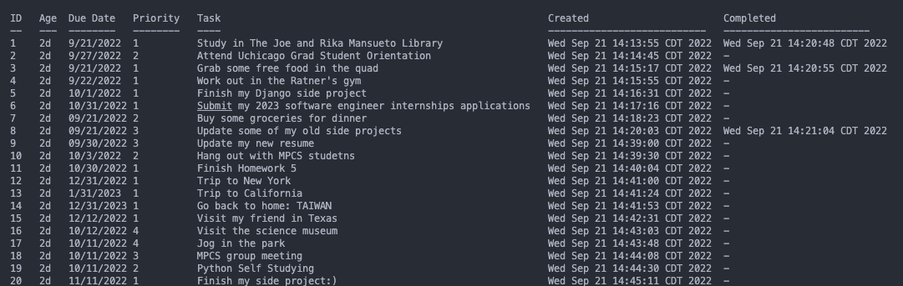

# Command Line Task Manager


## About
An object oriented task manager application that will allow user to enter tasks, save them to a file, and retrieve them...all without moving your hands from the keyboard.

## Preview 


## Prerequisite
```python >= 3.6 ```


## How to run the program

You can pass in ```commands``` and ```arguments``` to  alter the behavior of the program.

### --add
- Add a new task by using the ```add``` command
```bash
$ python task_mangaer.py --add "Study in The Joe and Rika Mansueto Library" --due 9/24/2022 --priority 1
```
```
Created task 1
```


### --list
- Use the ```list``` command to display a list of the not completed tasks sorted by the due date
```bash
$ python task_mangaer.py list
```
```
ID   Age  Due Date   Priority   Task
--   ---  --------   --------   ----
1    3d   9/24/2022   1         Study in The Joe and Rika Mansueto Library
2    10d  9/27/2022   3         Grab some free food in the quad
3    1d   -           1         Attend UChicago grad student oreintation
4    30d  -           2         Finish my Django side project
```

### --query
- Search for tasks that match a search term using the ```query``` command
```bash
$ python task_manager.py --query study
```

```
ID   Age  Due Date   Priority   Task
--   ---  --------   --------   ----
1    3d   9/24/2022   1         Study in The Joe and Rika Mansueto Library
```

- Muliple terms could be searched
```bash
$ python task_manager.py --query study food
```
```
ID   Age  Due Date   Priority   Task
--   ---  --------   --------   ----
1    3d   9/24/2022   1         Study in The Joe and Rika Mansueto Library
2    10d  9/27/2022   3         Grab some free food in the quad
```

### --done
- Complete a task by passing the ```done``` argument and the unique identifier
```bash
$ python task_manager.py --done 1
Completed task 1

$ python task_manager.py --done 2
Completed task 2

$ python task_manager.py --list
```
```
ID   Age  Due Date   Priority   Task
--   ---  --------   --------   ----
3    1d   -           1         Attend UChicago grad student oreintation
4    30d  -           2         Finish my Django side project
```

### --delete
- Delete a task by passing the ```delete``` command and the unique identifier
```bash
$ python task_manager.py --delete 3
Deleted task 3

$ python task_manager.py list
```
```
ID   Age  Due Date   Priority   Task
--   ---  --------   --------   ----
4    30d  -           2         Finish my Django side project
```

### --report
- List all tasks, including both completed and incomplete tasks, using the ```report``` command
```bash
$ python todo.py report
```
```
ID   Age  Due Date   Priority   Task                                        Created                        Completed
--   ---  --------   --------   ----                                        ---------------------------    -------------------------
1    3d   9/24/2022   1         Study in The Joe and Rika Mansueto Library  Wed Sep  21 12:10:08 CDT 2022  Wed Sep  24 11:07:01 CDT 2022
2    10d  9/27/2022   3         Grab some free food in the quad             Wed Sep  14 11:09:12 CDT 2022  Wed Sep  24 11:07:15 CDT 2022
3    1d   -           1         Attend UChicago grad student oreintation    Fri Sep  23 10:02:07 CDT 2022
4    30d  -           2         Finish my Django side project               Wed Aug  24 01:11:22 CDT 2022
```

## Note
- ```tasks.pickle``` and ```unique_id.pickle``` file can record all the information (tasks & unique id) you enter in this command line task manager application.
- You can delete this two files  when you initiate your own application.